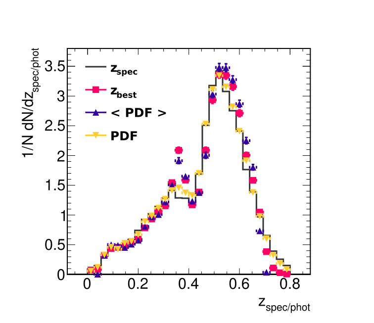

# Redshift-Estimation-Using-NN
Explore the use of NN to estimate the redshift of different galaxies based on photometry. We use data where the spectroscopic redshift is known. The dataset consists of a catalog from the SDSS DR16

---

# Descripción del proyecto

- Data: [link](https://drive.google.com/file/d/1MwcRINI1aGcdfMXlY70xMNF2INpZtnwK/view)
- SkyServer: [link](https://skyserver.sdss.org/dr16/en/tools/search/SQS.aspx)
- REF Sadeh-2016: ANNz2 - photometric redshift and probability distribution function estimation using machine learning. [link](https://arxiv.org/pdf/1507.00490)

## Objetivo 

Entrenar y evaluar una red neuronal que estime el redshift fotométrico a partir de propiedades físicas de las galaxias usando datos de SDSS DR16. Para esto cuenta con una tabla compuesta por **150,000 galaxias y quasares**, con **66 features**.

## Recomendaciones para el pre-procesamiento 

1. Exploración inicial del dataset: consultar fuente de los datos y revisión de la literatura.

2. Visualización y análisis estadístico de cada variable, detección de outliers.

3. Análisis y manejo de datos faltantes (missing data). Se puede intuir el mecanismo por el cual ciertas entradas corresponden a NaN/inf?

4. Aplicar (si corresponde) métodos de imputación y justificar su elección.

5. Evaluar la importancia de las características (feature importance) y decidir si conviene eliminar o generar nuevas variables (justifique). Estudiar correlación entre características, y con la variable a predecir (redshift fotométrico).

6. Estandarización o normalización de características.

7. Train-Validation-Test split.

8. Entrenar red(es) neuronal(es). Análisis correspondiente de overfitting, arquitectura, optimizer, Dropout, tasa de aprendizaje, función de perdida.

9. Opcionalmente:
	- Luego que el objetivo principal haya sido completado, profundizar en el análisis por ejemplo: 
		1. Cuantificar la incertidumbre de las predicciones (quizás RF) u obtener una distribución de probabilidad.
		2. Comparación de resultados con los obtenidos usando métodos de machine learning convencionales.

